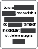

<div align="center">
  
  <h1>lib-redactor</h1>
  <p>Another library that will help you ██████ texts with ease.</p>
  <a href="http://www.wtfpl.net/"></a>
  <a href="https://codeclimate.com/github/yakovmeister/redactor/maintainability"></a>
  <a href="https://codeclimate.com/github/yakovmeister/redactor/test_coverage"></a>
</div>
<br />
<br />

## Installation  
  
```
npm install -S lib-redactor
```  
  
## Usage  
  
```typescript
import redactor from "lib-redactor";
  
const redactMe = {
  first_name: "John",
  last_name: "Doe",
  phone_number: "6969696969",
  email: "john.doe69@email.com"
};

const redactionRule = redactor(["phone_number", "email"]);

const redacted = redactionRule(redactMe);

console.log(redacted);
/// will log the following:
/// {
///   "first_name": "John",
///   "last_name": "Doe",
///   "phone_number: "6████████9",
///   "email": "j██████████████████m"
/// }
```  
## To do  
  
* nested object support
## License  
lib-redactor is [WTFPL licensed](LICENSE).